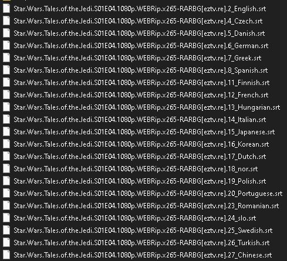
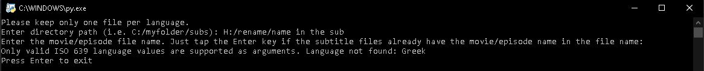
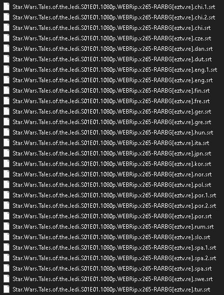
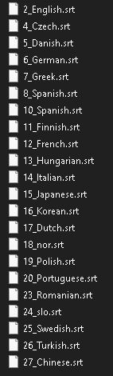
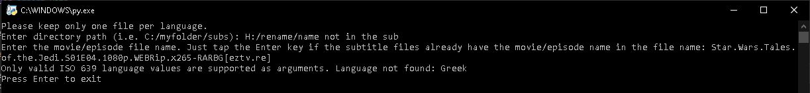

# SubtitleRenamerForPlex

This program rename the subtitle files so Plex can recognized the language assossiated to the video.
If you have multiple files with the same language, you can manually choose which one you want to keep and delete the other to be sure to keep the right one or this program will increment a number at the end. Plex may not recognized all files.

The program will ask you two arguments. The path and the video name. Please keep the video name blank if the subtitile file name already contains the name of the video. Or you can pass the Path and video name in argument from the console.


### Download and install
```
git clone git@github.com:Bradford1138/SubtitleRenamerForPlex.git
cd SubtitleRenamerForPlex
pip install -r requirements.txt
```

### Examples
Example of subtitle files with the name of the video: \



\
\
Example of subtitle files without the name of the video: \


